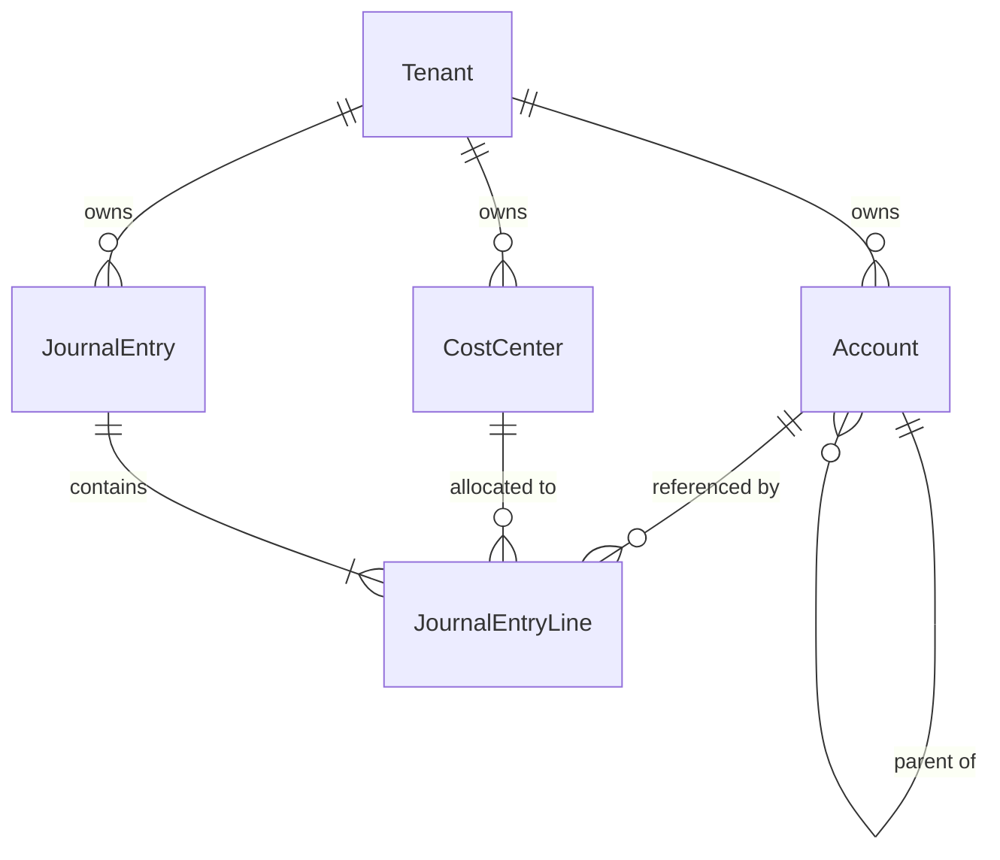

# Database Schema Documentation

This document describes the data model for the **BAK Open Compatibility Ledger**. The schema is designed for multi-tenancy, financial precision, and strict accounting practices.

## 📊 Entity Relationship Summary

The system is centered around the **Tenant** (the business unit). All financial data is strictly partitioned by `tenantId`.

---

## 🏗️ Models

### 1. Tenant
Represents a distinct business organization.
-   **`id`**: (GUID) Primary key.
-   **`name`**: Display name of the entity.
-   **`slug`**: Unique URL-friendly identifier.
-   **`fiscalYearEndMonth`**: (1-12) Determines the structural end of the fiscal cycle (e.g., 12 for Calendar Year). It does **not** determine the start date of operations or data visibility.
-   **`reportingCurrency`**: (ISO 4217) The base currency for the ledger.
-   **`isActive`**: Boolean flag for soft-disabling tenants.

### 2. Account (Chart of Accounts)
The classification system for financial transactions.
-   **`code`**: (String) Unique within a tenant (e.g., "1010", "4000").
-   **`name`**: Description (e.g., "Cash", "Sales Revenue").
-   **`type`**: Enum (`ASSET`, `LIABILITY`, `EQUITY`, `REVENUE`, `EXPENSE`).
-   **`parentId`**: Self-referencing ID for hierarchical structures.
-   **`isActive`**: Logical status.

### 3. Cost Center
Used for departmental or project-based tracking.
-   **`code`**: Unique identifier (e.g., "DEPT-SALES").
-   **`name`**: Descriptive name.

### 4. Journal Entry (Aggregate Root)
The header of a financial transaction.
-   **`description`**: Narrative of the transaction.
-   **`reference`**: Optional external ID (invoice number, etc.).
-   **`transactionDate`**: When the event actually occurred.
-   **`postingDate`**: When the event impacts the financial books.
-   **`status`**: Enum (`DRAFT`, `POSTED`, `VOIDED`).
    -   *Note*: Only `POSTED` entries affect balances.
-   **`version`**: Used for optimistic concurrency control.

### 5. Journal Entry Line
Individual debit or credit components.
-   **`direction`**: Enum (`DEBIT`, `CREDIT`).
-   **`amount`**: (Decimal 18,2) Stored with high precision.
-   **`accountId`**: Links to the specific Account item.
-   **`costCenterId`**: Optional allocation target.

---

## 💡 Technical Notes

### Financial Precision
Values are stored as `Decimal(18,2)` in PostgreSQL. In the application layer, these are mapped to `CsDecimal` from `dotnet-node-core` to ensure zero rounding errors during calculations.

### Multi-tenancy Isolation
All queries MUST include `tenantId`. The database enforces uniqueness on `[tenantId, code]` for Accounts and Cost Centers to allow identical codes across different organizations.

### Immutability
Once a `JournalEntry` is moved to `POSTED` status, the application layer (Core) enforces rules that prevent further modifications to preserve audit integrity. Changes must be made via reversal or adjustment entries.
